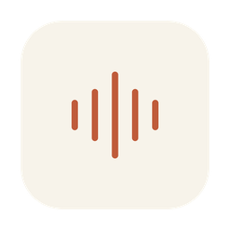
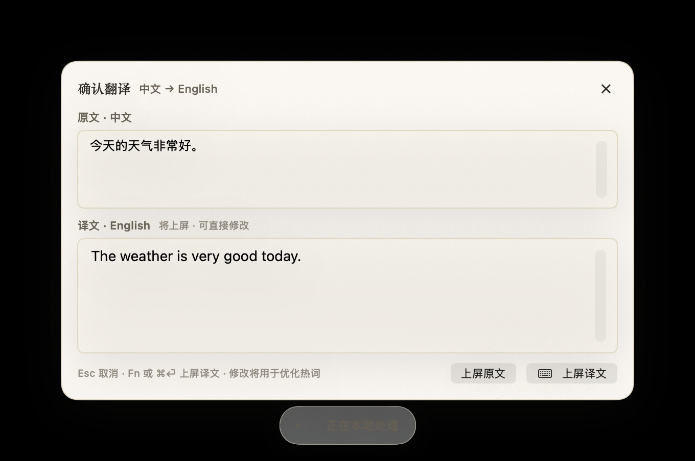

<div align="center">



# Velora

**按下 `Fn`，开口说话，文字落在光标处——已润色，需要的话还带翻译。**

100% 本地推理的 macOS 语音输入工具。没有云端、没有账号，音频永远不离开你的 Mac。

[](#环境要求)
[](Velora/Package.swift)
[](#隐私)
[](LICENSE)

[English](README.md) · [简体中文](README.zh-CN.md)

</div>

---

<p align="center">
  <br/>
  <em>翻译模式：说中文，确认双语卡片，按 ⌘⏎——英文落在光标处。</em>
</p>

<p align="center">
  <br/>
  <em>录音时屏幕底部的安静 HUD——不抢焦点、不挡点击。</em>
</p>

## 为什么做 Velora

大多数听写工具让你在质量和隐私之间二选一，Velora 拒绝这道选择题：

- **真·本地。** 语音识别、润色、翻译全部在本机运行。断网照样工作。
- **全系统可用。** 菜单栏常驻，往任何 App 的光标处上屏——编辑器、浏览器、聊天窗口都行。
- **一个键搞定。** 轻按 `Fn` 开始，再按结束。通过 CGEventTap 完整接管这个键，系统输入法切换器不会再来捣乱。
- **产出的是成句，不是逐字流水账。** 每次输出都经过分层 compose：确定性清理、受语境约束的纠错、按应用类别排版，再在时限内采用本地 LLM 润色。若模型丢失数字、URL、代码标识、已学习术语或改变原语言，保真护栏会拒绝该结果。

## 工作原理

面向用户只有两个模式，底下是同一条管线：

```
输入模式（Fn）：  ASR + 受约束纠错 → 场景化 compose { polished }         → 保真护栏 → 上屏
翻译模式（Fn⇧）： ASR + 受约束纠错 → 场景化 compose { polished, target } → 保真护栏 → 确认 → 上屏
```

| 环节 | 引擎 | 说明 |
|---|---|---|
| 语音识别 | [SenseVoice](https://github.com/FunAudioLLM/SenseVoice)（常驻 `sherpa-onnx` sidecar） | 模型只加载一次、常驻内存，比每句拉起进程快约 18 倍。可选 `whisper.cpp`、Apple Speech。 |
| 润色 / 翻译 | 本地 LLM，走 [Ollama](https://ollama.com)（默认 `qwen3:8b`） | 一次 compose 调用；翻译只是多一个输出字段，不是多一跳。按开发工具、聊天、邮件、文档等应用类别控制排版；超时、JSON 异常、语言错误或保真护栏失败时回退规则层。 |
| 本地学习 | SQLite 记忆层 + correction journal | 翻译确认卡片的源文修改，以及输入模式上屏后短时间内的修改，都会成为本地反馈；拼音门控的历史句例和已晋升词条可在下一次匹配输入中生效。 |

延迟被当作产品功能来做：录音期并行准备、模型常驻、compose 硬时限。完整架构见 [`docs/PRODUCT_TECH_DESIGN.md`](docs/PRODUCT_TECH_DESIGN.md)。

### 会进化，但有边界

Velora 当前通过保守的本地反馈闭环进化，并不是在线自动训练模型：

- 只在有限时间窗内观察 Velora 刚插入的那一段；安全输入框和受限应用一律不学习；
- 只有新输入包含相同发音时才召回历史纠错；自动词对至少要在两个独立 session 获得证据才会晋升；
- 标点、空格和换行修改会作为 style signal 保留，但按 App 的风格统计学习和自动 LoRA 目前明确未启用；
- 微调导出器强制使用线上同一份 system prompt、app-format 输入字段和 `{"polished": ...}` JSON 契约，避免未来离线训练与生产链路漂移。

设计依据与竞品/论文调研见 [`docs/VOICE_DICTATION_BEST_PRACTICES.md`](docs/VOICE_DICTATION_BEST_PRACTICES.md)，已实现的反馈闭环见 [`docs/LEARNING_PIPELINE.md`](docs/LEARNING_PIPELINE.md)。

## 快速开始

### 环境要求

- macOS 14+（推荐 Apple Silicon）、Xcode 16+
- [XcodeGen](https://github.com/yonaskolb/XcodeGen)（`brew install xcodegen`）
- [Ollama](https://ollama.com) 并拉好模型：`ollama pull qwen3:8b`（可用 `VELORA_OLLAMA_MODEL` 覆盖）
- Python 3（ASR sidecar 需要一个小 venv）

### 1. 克隆并下载 ASR 模型

```bash
git clone https://github.com/0x5446/velora.git
cd velora

# 从 sherpa-onnx releases 下载 SenseVoice int8 ONNX 包（含 model.int8.onnx 与 tokens.txt）：
mkdir -p Models/sensevoice && cd Models/sensevoice
curl -LO https://github.com/k2-fsa/sherpa-onnx/releases/download/asr-models/sherpa-onnx-sense-voice-zh-en-ja-ko-yue-2024-07-17.tar.bz2
tar xjf sherpa-onnx-sense-voice-zh-en-ja-ko-yue-2024-07-17.tar.bz2 --strip-components=1
python3 -m venv .venv && .venv/bin/pip install sherpa-onnx soundfile numpy
cd ../..
```

应用会在仓库根目录下寻找 `Models/sensevoice/`（也支持 `~/workspace/velora/` 或 `~/Library/Application Support/Velora/`）。

### 2. 生成工程并构建

```bash
xcodegen generate
xcodebuild -project Velora.xcodeproj -scheme Velora -configuration Debug build
```

> **签名说明：** `project.yml` 固定了开发团队，用于稳定 TCC 授权。任何要实际运行的本地版本都应使用上面的正常签名命令。不要在已安装/正在运行的 Debug App 所用 DerivedData 路径上执行 `CODE_SIGNING_ALLOWED=NO`：它会用 ad-hoc 产物覆盖开发者签名包，macOS 随即不再认可原辅助功能授权。CI 若只做免签编译检查，必须使用独立的 `-derivedDataPath`。

### 3. 首次运行设置

1. 启动 Velora——它常驻菜单栏（波形图标），不占 Dock。
2. 授予**麦克风**（自动弹窗）和**辅助功能**（系统设置 → 隐私与安全性 → 辅助功能）——`Fn` 键监听和光标上屏都依赖它。
3. 建议把 系统设置 → 键盘 → "按下🌐键时" 设为 **无操作**，让系统输入法切换器彻底让路。等价命令：
   ```bash
   defaults write com.apple.HIToolbox AppleFnUsageType -int 0
   ```

### 日常使用

| 操作 | 按键 |
|---|---|
| 开始 / 结束听写 | `Fn` |
| 开始 / 结束翻译听写 | `Fn ⇧` |
| 取消录音 | `Esc` |
| 确认卡片：上屏首选一侧 | `⌘⏎`（或 `Fn`） |
| 确认卡片：改完原文重新翻译 | `⌘R` |
| 确认卡片：放弃 | `Esc` |

快捷键可在设置里改（提供 ⌥Space 备选）。翻译目标语言、上屏哪一侧、开发者诊断也都在设置里。

## 隐私

- 只在你主动听写时采集音频，内存中处理，从不上传——根本没有服务器。
- 菜单栏的麦克风使用指示是 macOS 系统自带的；Velora 绝不在 `Fn` 会话之外录音。
- 唯一的网络依赖是 `localhost`（Ollama）。
- 学习反馈只保存在 `~/Library/Application Support/Velora/`。用于未来实验的音频保留是独立 opt-in 设置，默认关闭，并受 2 GB 本地环形配额限制。

## 目录结构

```
Apps/VeloraMac/        macOS 菜单栏应用（HUD、确认卡片、设置、Fn 事件拦截）
Apps/VeloraiOS/        iOS 原型
Apps/VeloraKeyboard/   iOS 自定义键盘扩展（桥接上屏）
Velora/                Swift 包：管线、引擎、设计系统、存储
docs/                  产品/技术设计、模型策略、调优报告
scripts/               SenseVoice sidecar、图标生成器、评测脚本
pocs/                  早期概念验证
```

UI 遵循一套小而完整的暖色"科技复古"设计系统（米色纸面、墨色文字、陶土橙点缀、衬线标题），定义在 [`Velora/Sources/Velora/DesignSystem/`](Velora/Sources/Velora/DesignSystem/)——一处 token 同时驱动 Mac、iOS 和键盘扩展。

## 疑难排查

| 症状 | 处理 |
|---|---|
| 按 `Fn` 还会弹系统输入法切换器 | 把"按下🌐键时"设为无操作（见首次设置第 3 步） |
| 按 `Fn` 完全没反应 | 辅助功能未授权（或 App 被免签重编）——先用配置好的 Apple Development 身份重建，必要时在系统设置里重新开关 Velora，然后重启应用 |
| 输出粗糙 / 没有译文 | Ollama 没跑或模型缺失——Velora 会降级为规则清理；`ollama serve` + `ollama pull qwen3:8b` |
| 菜单里显示"需要无障碍权限" | 同上——授权后重启应用 |

## 路线图

- [ ] 公证发布版（重新开启 hardened runtime）
- [ ] iOS 键盘扩展内直接听写
- [ ] 可插拔 ASR/LLM 引擎矩阵（MLX、llama.cpp server）
- [ ] 按 App 的统计风格学习与显式用户覆盖
- [ ] 离线 LoRA 评测与 opt-in 上线（不做在线自动训练）

## 参与贡献

欢迎 Issue 和 PR。先读 [`docs/PRODUCT_TECH_DESIGN.md`](docs/PRODUCT_TECH_DESIGN.md) 了解架构契约，并保持两模式管线的统一语言（`compose { polished, target }`）——原因见文档。改过 `project.yml` 记得跑 `xcodegen generate`；生成的 `.xcodeproj` 是入库的。

## 许可证

[MIT](LICENSE)
